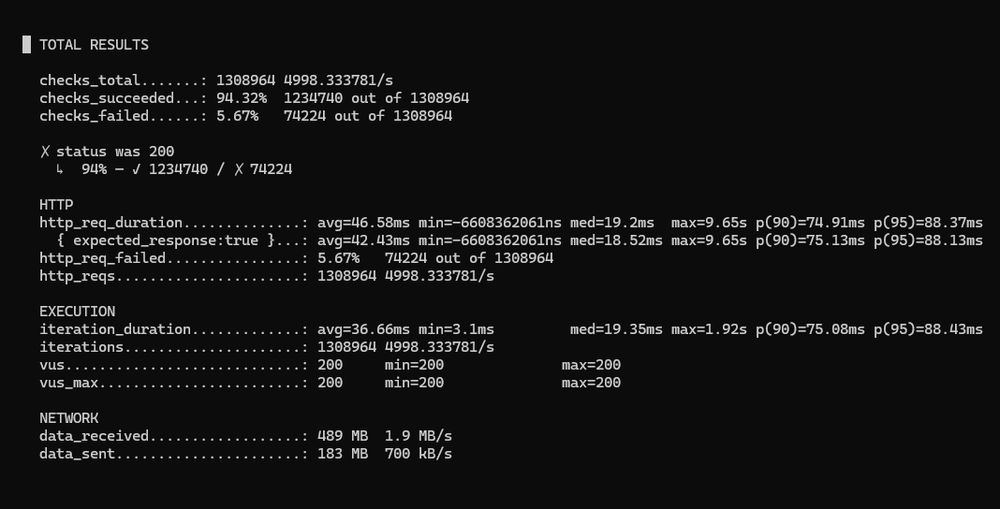
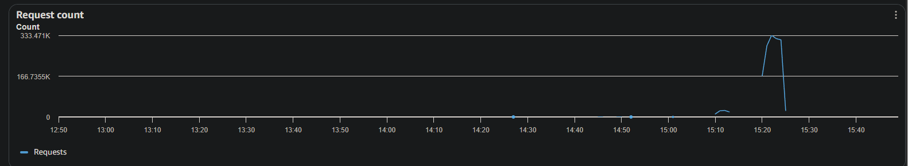
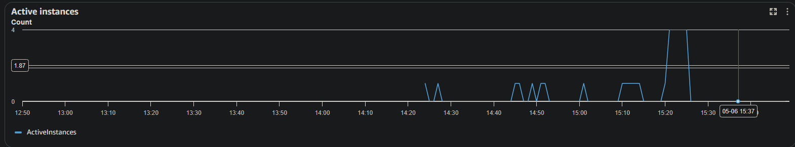

# Full-Stack Application Deployment (Technical Test)

A fully containerized application deployed to AWS App Runner with a complete CI/CD pipeline, infrastructure-as-code (Terraform), and auto-scaling capabilities.

## Architecture Overview

*   **Frontend:** React (Vite) served via Nginx.
*   **Backend:** Node.js (Express) API.
*   **Infrastructure:** AWS App Runner (Serverless Containers) provisioned via Terraform.
*   **Container Registry:** AWS Elastic Container Registry (ECR).
*   **State Management:** Terraform state is securely managed remotely via an AWS S3 backend.
*   **CI/CD:** GitHub Actions automates building, tagging, and deploying zero-downtime updates.

### Public URLs
*   **Frontend UI:** `https://y2nhrtgr9z.eu-west-3.awsapprunner.com/`
*   **Backend API:** `https://jpk6h6z7ge.eu-west-3.awsapprunner.com/api/message`
*   **Health Check:** `https://jpk6h6z7ge.eu-west-3.awsapprunner.com/health`

## Folder Structure

This repository is organized as a monorepo to maintain the link between infrastructure and application code.

    .
    ├── .github/workflows/          # CI/CD Pipeline definitions
    │   ├── aws-deploy.yml          # Automated Build & Deploy (Main Branch)
    │   └── terraform-apply.yml     # Manual Infrastructure provisioning
    ├── backend/                    # Node.js Express API
    │   ├── src/                    # API Logic & Routes
    │   ├── Dockerfile              # Backend containerization
    │   └── package.json            # Backend dependencies
    ├── frontend/                   # React (Vite) Application
    │   ├── src/                    # UI Components & Logic
    │   ├── public/                 # Static assets
    │   ├── Dockerfile              # Multi-stage build (Node -> Nginx)
    │   └── package.json            # Frontend dependencies
    ├── terraform/                  # Infrastructure as Code (IaC)
    │   ├── main.tf                 # Primary AWS resource definitions
    │   ├── variables.tf            # Configurable parameters
    │   └── outputs.tf              # Values exported for CI/CD use
    ├── load-test/                  # Performance & Scalability testing
    │   ├── script.js               # k6 test scenarios
    │   └── results/                # Screenshots of scaling events
    ├── docker-compose.yml          # Local orchestration
    └── README.md                   # Project documentation

---

## Technical Deep Dive: Component Breakdown

### Infrastructure (`/terraform`)
*   **Provider Logic:** Configured for AWS region `eu-west-3` (Paris).
*   **State Management:** Uses an S3 Backend to ensure Terraform state is preserved between GitHub Action runs.
*   **Resources:** Provisions ECR repositories for image storage and App Runner services for serverless execution.

### Backend API (`/backend`)
*   **Engine:** Node.js with Express.
*   **Containerization:** Uses a lightweight `node:alpine` base image to minimize deployment time and security surface area.
*   **Observability:** Integrated with `morgan` for structured HTTP logging and health check endpoints.

### Frontend UI (`/frontend`)
*   **Framework:** React (Vite) for modern, fast development.
*   **Production Serving:** The Docker container uses a multi-stage build. It compiles the React code and then copies the static output to an **Nginx** server, which handles public traffic on Port 80.
*   **Environment Injection:** The API URL is injected at build-time using `VITE_` prefixed variables, allowing the UI to connect to the dynamically generated App Runner backend.

### Load Testing (`/load-test`)
*   **Tooling:** k6 (Go-based load generator).
*   **Goal:** Simulates high-concurrency traffic to validate the App Runner Auto-Scaling configuration.

---

## How to Run Locally

The project is fully containerized for a seamless local developer experience.

**Prerequisites:** Docker and Docker Compose.

1. Clone the repository.
2. Run the following command from the root directory:

    docker-compose up --build

3. Access the Frontend at `http://localhost:80`
4. Access the Backend at `http://localhost:8081`

---

## CI/CD & GitHub Workflows

This project utilizes two specialized GitHub Action workflows to manage the lifecycle of the infrastructure and the application code.

### 1. Infrastructure Management (`terraform-apply.yml`)
This workflow is triggered manually via **workflow_dispatch**. It allows engineers to provision or modify AWS resources without local CLI access.
*   **Dynamic Actions:** Provides a UI choice to run either a `terraform plan` (for impact analysis) or `terraform apply` (for execution).
*   **Secure State:** Authenticates with AWS to access the S3 Remote Backend, ensuring the infrastructure state is consistent across the team.

### 2. Automated Deployment Pipeline (`aws-deploy.yml`)
Triggered automatically on every **push to the main branch**. This pipeline handles the full build-to-deploy lifecycle:
*   **Infrastructure Discovery:** The pipeline initializes Terraform to dynamically fetch the Backend API URL from the remote state. This URL is injected into the Frontend build as a build argument (`VITE_API_URL`).
*   **Containerization:** It builds optimized Docker images for both services and pushes them to **AWS ECR**.
*   **Rolling Updates:** Once the new images are pushed, AWS App Runner detects the update and performs a rolling deployment, replacing instances only after health checks pass to ensure zero downtime.

---

## Key Technical Decisions

*   **AWS App Runner vs. ECS:** App Runner was selected for rapid delivery of a fully managed, auto-scaling service. However, following the 2026 deprecation notice, the roadmap includes a migration to **Amazon ECS Express Mode** for long-term support.
*   **Dynamic Decoupling:** By querying the Terraform state during the CI/CD build, the Frontend remains decoupled from the Backend's physical infrastructure. If the Backend moves to a different URL, the Frontend automatically updates during the next deployment.
*   **S3 Remote Backend:** Moving `terraform.tfstate` to S3 prevents state loss (as GitHub Action runners are ephemeral) and enables team collaboration.

---

## System Behavior Under Load

To demonstrate the system's auto-scaling capabilities, an aggressive load test was executed using **k6** to breach the AWS App Runner concurrency threshold (`max_concurrency = 20`).

**Scenario:** 
The test utilized **200 Virtual Users (VUs)** with zero sleep delay, hammering the `/health` endpoint to stack TCP connections and trigger a scale-out.

**Results & Analysis:**
*   **Throughput:** The system processed **1,308,964 requests** at a sustained rate of ~5,000 requests per second.
*   **Latency:** Median response time was held at a remarkable **19.2ms**.
*   **Scalability:** As the load increased, AWS App Runner successfully provisioned additional capacity, scaling from 1 instance to **4 active instances**.

### How to Reproduce the Load Test

1. Ensure your backend URL is set in `load-test/script.js`.
2. Run the test via Docker:

**On Mac/Linux:**

    docker run --rm -i grafana/k6 run - < load-test/script.js

**On Windows (PowerShell):**

    Get-Content load-test\script.js | docker run --rm -i grafana/k6 run -

---

## Observability: Logs & Metrics

The application is integrated with **Amazon CloudWatch** to provide deep visibility into system health, performance, and scaling events.

### 1. Application Logs (Distributed Tracing)
Every request processed by the backend is captured and streamed to CloudWatch Logs. 
*   **Structured Logging:** The Node.js backend utilizes `morgan` to log standard HTTP metadata (Method, Path, Status Code, Response Time).
*   **Error Tracking:** Any uncaught exceptions or 500-series errors are automatically captured in the log stream for rapid debugging.
*   **Accessing Logs:** 
    1. Navigate to the **App Runner Service** in the AWS Console.
    2. Click on the **Logs** tab.
    3. View the **Service Logs** (deployment/health check events) or **Application Logs** (live traffic output).

### 2. Performance Metrics
AWS App Runner provides real-time telemetry used to monitor the "Pulse" of the application:
*   **RequestCount:** Total number of requests over a specific period. (Observed during the k6 test reaching ~5,000 req/s).
*   **ActiveInstances:** A real-time count of container instances currently serving traffic. 
*   **RequestLatency:** The time taken for the service to respond to requests (Median and p95).

### 3. Scaling Metrics (The "Heartbeat")
The most critical metric for this project is **Concurrency**. 
*   **Metric Name:** `Concurrency` (Active connections per instance).
*   **Threshold:** When the average concurrency exceeds **20**, the App Runner Auto-Scaling configuration triggers a scale-out event.
*   **Verification:** This can be visualized in the **Monitoring** tab under "Active Instances" vs "Request Count."

---

## Troubleshooting Guide

If the application is not behaving as expected, follow these steps:

1. **Check Health Status:** Verify that the "Service Status" in App Runner is `Running`. If it is `Degraded`, check the **Service Logs** for failing health checks.
2. **Review Deployment Logs:** If a GitHub Action deployment fails, check the logs to see if the container failed to start or if there was a `VPC_CONNECTOR` configuration error.
3. **Trace API Errors:** Search the **Application Logs** for `5XX` status codes to identify backend crashes or timeout issues.

## Known Limitations and Possible Improvements

1.  **Migration to ECS:** Transitioning infrastructure to ECS Fargate for long-term AWS support.
2.  **Database Integration:** Implementing an RDS or DynamoDB instance via Terraform for persistent data storage.
3.  **Security Hardening:** Integrating AWS WAF and rate-limiting at the App Runner level to mitigate the minor failure rate seen during extreme 5,000 RPS surges.
